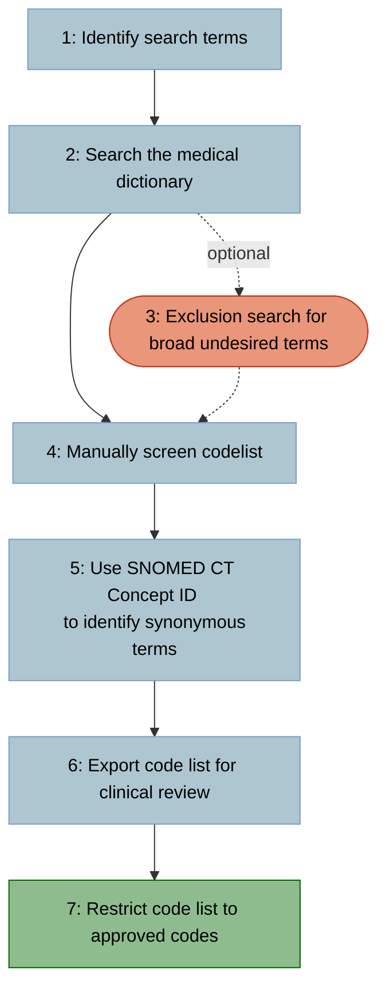

# How to: create SNOMED CT codelists for primary care electronic healthcare records

This is an extension of [current standard practice for primary care codelist creation](http://dx.doi.org/10.1136/bmjopen-2017-019637) which adds additional steps to take advantage of automated searches and advanced features of the SNOMED CT medical terminology to create more comprehensive codelists.

Creating a SNOMED CT codelist can be broken down in to 7 steps:


1. **Identify search terms.**
    - To begin, you need to identify all terms and synonyms related to your clinical event of interest.
    - Next you need to create "search terms" to find each of these terms, making use of wildcard characters (*) to account for spelling variations, capitalisation, hyphenation, and other grammatical variations.
        - For example, to search for vaccines you may use the search terms: “\*vaccin\*”, “\*immunis\*”, and “\*immuniz\*”.

1. **Search the medical terminology dictionary using the search terms.**
    - Import the medical dictionary that includes the SNOMED CT term descriptions along with their Description ID and Concept ID.
    - Search the dictionary for each of your search terms defined in **Step 1**, ensuring that the dictionary terms are passed through a `lower()` function to avoid missing matches due to differing case.
    - Once you have searched the dictionary for all your terms, keep only the SNOMED CT terms that matched with at least 1 of your search terms.

1. **(OPTIONAL) Perform a secondary search to exclude broad undesired terms.**
    - There is a good chance that your search terms will also identify terms that are irrelevant to your clinical event of interest.
    - If there are a lot of irrelevant terms detected by the search terms defined in **Step 1**, you can perform another search on the included terms using *exclusion* search terms. This will highlight terms that should be removed from the current list.
    - Before removing any terms highlighted for exclusion, make sure any desired terms are not erroneously highlighted.
    - If the list of terms found after completing **Step 2** is short, you can skip straight to **Step 4**.

1. **Manual screen of codelist to remove undesired terms.**
    - It is important to complete a final manual screen of the codelist generated by your searches and manually remove any undesired codes using their Description ID (or medcodeid if using CPRD Aurum).

1. **Use the SNOMED CT Concept ID to find additional synonymous terms.**
    - SNOMED CT uses a Concept ID to refer to a single clinical concept that may have multiple terms associated with it.
        - For example, the medical concept of "myocardial infarction" has the synonyms "heart attack" and "infarction of heart". While these all have different Description IDs, they all have the same Concept ID.
    - Therefore we can use the Concept IDs of our current codelist to find further synonyms to add.
    - After adding the additional terms, check that they are appropriate. If they are not, consider whether the other terms associated with that concept are also appropriate. If the original terms are appropriate but the new terms are not, discard the newly found terms.

1. **Export codelist for review by a primary care clinician.**
    - Export your codelist as an Excel spreadsheet (making sure SNOMED CT codes are stored as text rather than numbers).
    - Ask a clinician with primary care experience to review your codelist and check that the codes are appropriate to identify your clinical event of interest.
    - Ask the reviewing clinican to generate a column at the end of the spreadsheet headed with their initials where they label the list of terms with a 0 or 1 to classify terms that they would exclude (0) or include (1).

1. **Restrict your codelist to codes approved by a primary care clinician and save.**
    - Remove any codes from the codelist that were marked with a 0 by the reviewing clinican in **Step 8**.
    - Save your finished codelist and export it.
    - Your codelist is now ready to use!

## Example *Stata* code

This example code is a creation script for a depression codelist for *CPRD Aurum*, however the code could be applied to any database using SNOMED CT codes if the `medcodeid` variable is replaced with the SNOMED CT Description ID variable. The do file can be found [here](/scripts/stata/depression.do).
```stata
//==============================================================================
// 2025-05-13 PWS simple codelist creation template
//
// DEPRESSION
//
// Lines with 2 asterisks (**) at the beginning and end require modification
// Lines with 1 asterisk (*) at the beginning and end MAY require modification
//==============================================================================


// Initialise do file & import CPRD Aurum medical dictionary
//===========================================================

clear all
set more off

//** UPDATE THESE VARIABLES **==================================================

//**Working directory - where you will open/save files**
cd "C:\GitHub\SNOMED-CT-codelists\scripts\stata"

//**Enter name of do file here. This ensures all files have the same name.**
local filename "depression"

//*Aurum build/version*
local aurum_build "202309"

//==============================================================================

//Open log file
capture log close
log using `filename', text replace


//= CPRD LOOKUP LOCATION - would be good to get this in a shared location ======

//*Directory of medical dictionary*
local browser_dir "C:/lookups/`aurum_build'_Lookups_CPRDAurum"

//*Directory of label lookups*
local lookup_dir "C:/lookups/`aurum_build'_Lookups_CPRDAurum"

//==============================================================================


// Import CPRD medical browser; force medcodeid, SNOMED CT Description ID, 
// and SNOMED CT Concept ID to be string

// Filename can have 2 naming structures, choose appropriate line from below

//import delimited "`browser_dir'/CPRDAurumMedical.txt", stringcols(1 6 7) favorstrfixed
import delimited "`browser_dir'/`aurum_build'_EMISMedicalDictionary.txt", stringcols(1 6 7) favorstrfixed

//Drop useless variables
drop release emiscodecategoryid

order medcodeid observations originalreadcode cleansedreadcode ///
	snomedctconceptid snomedctdescriptionid term

//Save medical code browser to a tempfile
tempfile medical
save `medical'


// STEP 1. IDENTIFY SEARCH TERMS
//===============================

// **Define search terms below. Use multiple local macros if categorising 
//   desired codes in to multiple categories make more sense**

local depression " "*depress*" "


// STEP 2. SEARCH THE MEDICAL TERMINOLOGY DICTIONARY USING THE SEARCH TERMS
//==========================================================================

// **Add any additional local macros if you have used more than 1**
//For each specified local macro...
foreach termgroup in /**/depression/**/ {
	
	//Generate an empty binary indicator variable taking the name of the local macro
	gen byte `termgroup' = .
	
	//For each SNOMED CT term description (converted to lower case)...
	foreach codeterm in lower(term) {
		
		//For each individual search term in the local macro
		foreach searchterm in ``termgroup'' {
			
			//Set the indicator variable to 1 if the SNOMED CT term description matches the search term from the local macro
			replace `termgroup' = 1 if strmatch(`codeterm', "`searchterm'")
		}
	}
}

keep if /**/depression/**/ == 1
compress

gsort /**/depression/**/ snomedctconceptid snomedctdescriptionid originalreadcode

tab1 /**/depression/**/


// (OPTIONAL) STEP 3. PERFORM A SECONDARY SEARCH TO EXCLUDE BROAD UNDESIRED TERMS
//================================================================================

//Comment out this section if not required.

// **Exclusion terms**
// Create extra terms if it makes classifying easier

local exclude " "*family*history*" "*fh:*" "*decline*" "*offer*" "*negative*screening*" "*depress*screening*" "*fracture*" "*respiratory*" "*antipark*" "*syncope*" "*cent*nervous*sys*" "*cns*depressant*" "


//Search for codes to exclude
foreach excludeterm in exclude /**/ /*ANY OTHER EXCLUSION CATEGORIES*/ /**/ {

	gen byte `excludeterm' = .

	foreach codeterm in lower(term) {
		
		foreach searchterm in ``excludeterm'' {		
			
			replace `excludeterm' = 1 if strmatch(`codeterm', "`searchterm'")
		}
	}
}

//Check that nothing important is highlighted for exclusion before dropping
tab exclude, missing
list medcodeid term if exclude == 1
/**/ /*ANY OTHER EXCLUSION CATEGORIES*/ /**/

drop if exclude == 1
/**/ /*ANY OTHER EXCLUSION CATEGORIES*/ /**/

drop exclude /**/ /*ANY OTHER EXCLUSION CATEGORIES*/ /**/
count
compress


// STEP 4. MANUAL SCREEN OF CODELIST TO REMOVE UNDESIRED TERMS
//=============================================================

// ** List of medcodeids to remove **
local initial_remove "7106161000006117 7597201000006117"

gen byte remove = 0

foreach medcode of local initial_remove {
	
	replace remove = 1 if medcodeid == "`medcode'"
}

list medcodeid snomedctdescriptionid snomedctconceptid originalreadcode term if remove == 1
drop if remove == 1
drop remove

compress
tab1 /**/depression/**/


// STEP 5. USE THE SNOMED CT CONCEPT ID TO FIND ADDITIONAL SYNONYMOUS TERMS
//==========================================================================

//Check for missing SNOMED CT Concepts
codebook snomedctconceptid
assert !missing(snomedctconceptid)

count

//Make a note of current list
preserve

keep medcodeid /**/depression/**/
gen byte original = 1
tempfile original
save `original'

restore

//Merge SNOMED CT Concepts with medical dictionary
keep snomedctconceptid /**/depression/**/
bysort snomedctconceptid: keep if _n == 1
merge 1:m snomedctconceptid using `medical', nogenerate keep(match)
compress

//Merge with original search results
merge 1:1 medcodeid using `original', nogenerate
order medcodeid observations originalreadcode cleansedreadcode ///
	snomedctconceptid snomedctdescriptionid term
gsort /**/depression/**/ originalreadcode

//Label new codes
gen new_snomedct_synonym = (original != 1)
drop original

//Show new codes
foreach category of varlist /**/depression/**/ {
	
	display "New terms found for: `category'"
	list snomedctconceptid originalreadcode term ///
		if new_snomedct_synonym == 1 & `category' != .
}

//Check new codes in the context of originally included SNOMED CT Concept ID codes
preserve
	keep if new_snomedct_synonym == 1
	keep snomedctconceptid
	bysort snomedctconceptid: keep if _n == 1

	count
	local obs = r(N)

	forvalues i = 1/`obs' {
		
		if `i' == 1 {
			
			local expanded_ids = snomedctconceptid in `i'
		}
		else {
			
			local expanded_ids = "`expanded_ids' " + snomedctconceptid in `i'
		}
	}
restore

foreach expanded_id of local expanded_ids {
	
	display "SNOMED CT Concept ID for which additional terms where found: `expanded_id'"
	
	list medcodeid originalreadcode term new_snomedct_synonym ///
		if snomedctconceptid == "`expanded_id'"
}


// STEP 6. EXPORT CODELIST FOR REVIEW BY A PRIMARY CARE CLINICIAN
//================================================================

gsort /**/depression/**/ snomedctconceptid snomedctdescriptionid originalreadcode
compress
save `filename', replace
export excel `filename'_raw.xlsx, firstrow(variables) replace

/*
	Make sure that reviewing clinician's initials are appended to the end
	of the file name after reviewing.

	e.g. codelist_raw_ABC.xlsx
*/


// STEP 7. RESTRICT CODELIST TO CODES APPROVED BY CLINICIAN AND SAVE
//===================================================================

//Load clinician classifications
local clinician "ABC"

import excel `filename'_raw_`clinician', firstrow clear

//Remerge with original in case of any formatting issues with Excel spreadsheet
keep medcodeid `clinician'

tempfile `clinician'_classification
save ``clinician'_classification'

use `filename', clear

merge 1:1 medcodeid using ``clinician'_classification', nogenerate
recode `clinician' (. = 0)

//Remove codes marked for exclusion by clinician
display "Terms excluded by clinician..."
list medcodeid snomedctconceptid term if `clinician' == 0
drop if `clinician' == 0

//Save clinican approved codelist
gsort /**/depression/**/ snomedctconceptid snomedctdescriptionid originalreadcode
drop new_snomedct_synonym /*`clinician'*/
compress
save `filename', replace
export delimited `filename', replace quote


log close
```
